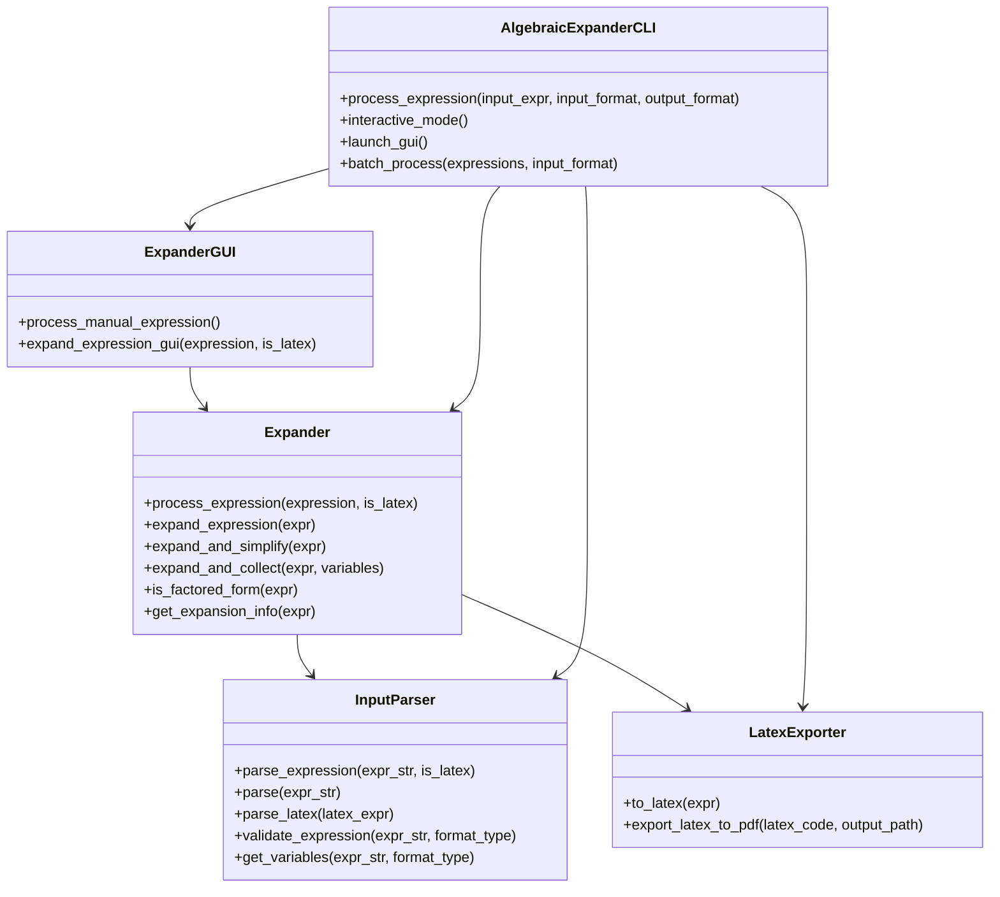

# ExpaAlge

Expansor algebraico

## Descripción
ExpaAlge es una herramienta para expandir expresiones algebraicas y convertirlas a formato LaTeX de manera sencilla, tanto desde una interfaz gráfica (GUI) como desde la línea de comandos (CLI). El proyecto está pensado para facilitar el manejo de expresiones matemáticas, permitiendo al usuario ingresar expresiones, expandirlas paso a paso, visualizar el resultado en LaTeX y exportar el resultado a PDF.

---

## Flujo de trabajo del proyecto

1. **Entrada del usuario:**
   - **GUI:** El usuario ingresa una expresión algebraica manualmente, selecciona ejemplos o ingresa expresiones en LaTeX.
   - **CLI:** El usuario ejecuta el programa, ingresa expresiones una a una o procesa un archivo de expresiones (modo batch).

2. **Parseo y validación:**
   - La entrada se pasa al módulo `InputParser`, que limpia la cadena (`clean_expression`), valida la estructura básica (`is_valid_expression`), convierte la sintaxis LaTeX a algo interpretable por SymPy y detecta variables.

3. **Expansión algebraica:**
   - Una vez parseada, la expresión se envía a la clase `Expander`, que utiliza SymPy para expandirla algebraicamente y opcionalmente agrupar términos.

4. **Conversión a LaTeX:**
   - El resultado expandido se convierte a formato LaTeX usando la clase `LatexExporter`, que lo puede mostrar en la interfaz o preparar para exportar.

5. **Presentación y exportación:**
   - **GUI:** El usuario puede visualizar los resultados, copiar el LaTeX, o exportar la expresión expandida como PDF.
   - **CLI:** Los resultados se muestran en consola y pueden guardarse o exportarse si se implementa esa opción.

---

## Arquitectura y clases principales

- **config.py:** Configuración centralizada (no contiene clases).
- **utils.py:** Solo contiene funciones esenciales para limpieza y validación de expresiones (`clean_expression`, `is_valid_expression`).
- **input_parser.py:**
  - `InputParser`: Convierte texto/LaTeX a SymPy, valida y limpia la entrada.
- **expander.py:**
  - `Expander`: Centraliza el procesamiento algebraico y la integración con el parser y el exportador LaTeX.
- **latex_exporter.py:**
  - `LatexExporter`: Convierte expresiones SymPy a LaTeX y exporta a PDF.
- **giu app.py:**
  - `ExpanderGUI`: Interfaz gráfica, interactúa con el usuario y delega el procesamiento a Expander.
- **main.py:**
  - `AlgebraicExpanderCLI`: Interfaz de línea de comandos, integra el flujo completo.

---

## Diagrama UML de clases



---

## Características adicionales
- Ejemplos predefinidos para la GUI
- Mensajes de error amigables
- Código modular y fácil de extender
- Exportación directa a PDF

---

## Cambios recientes
- Limpieza de utilidades: solo se mantienen las funciones esenciales en `utils.py`.
- Validación y limpieza centralizadas en el parser.
- Flujo de trabajo y arquitectura documentados y simplificados.
- Diagrama UML agregado para facilitar la comprensión y mantenibilidad.

---

## Uso rápido

**GUI:**
```bash
python main.py --gui
```

**CLI:**
```bash
python main.py -e "(x+1)^2"  # Entrada estándar
python main.py -e "\\left(x+1\\right)^2" --latex  # Entrada LaTeX
python main.py --batch expresiones.txt  # Procesamiento por lotes
```
